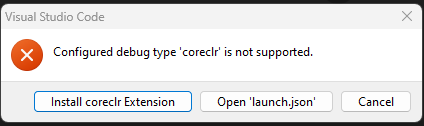
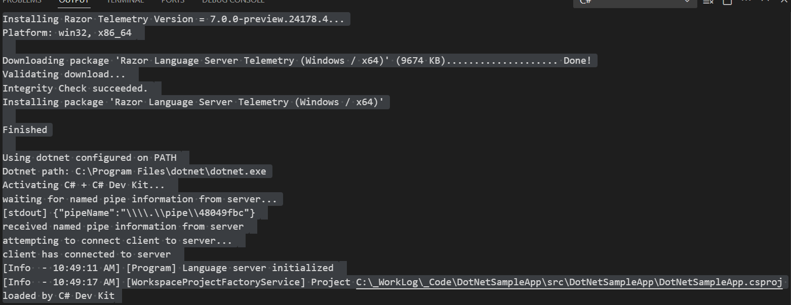
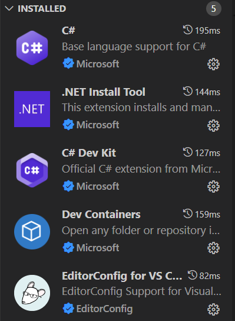

# DotNetSampleApp

## Saturday, 7/6/24

- Cloned repo to my desktop machine: `DESKTOP-5PV6HMC`
- Hit `Control-F5` and encountered:



- Noticed that I as in my default profile
- Went to my `C#` profile and clicked on `Reinstall Extensions` and got the following text in my terminal.
- (See `docs\2024-07-06-01-terminal.txt`)
- And I was able to run the app





## Thursday, 7/4/24

- Create directory & change to it
- Run `git init`
- Manually created `.vscode` directory and `settings.json`
- Added entry for:

```json
{
    "window.zoomlevel": 2
}
```

- And immediately noted that it took effect
- Updated `settings.json` as follows:

```json
{
    "editor.formatOnSave": true,
    "window.zoomLevel": 2,
    "terminal.integrated.defaultProfile.windows": "Git Bash"
}
```

- New terminal: `Control+Shift+{BACKTICK}`
- From project root directory:

```text
dotnet new console -o src/DotNetSampleApp
```

- And run with:

```text
dotnet run --project src/DotNetSampleApp
```


